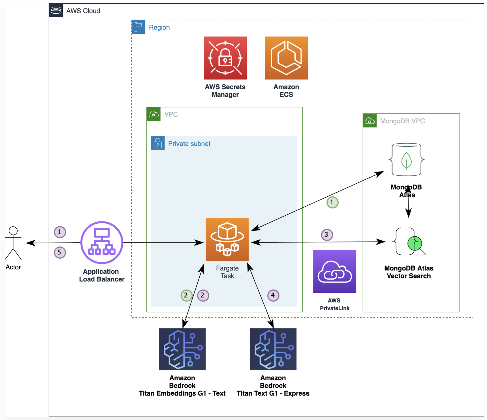
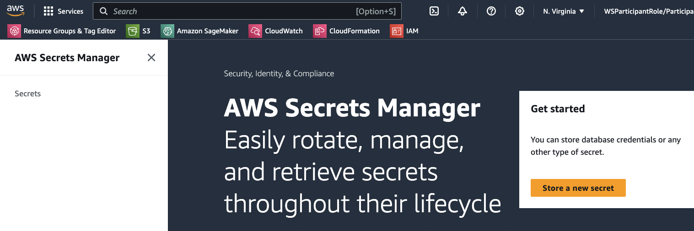
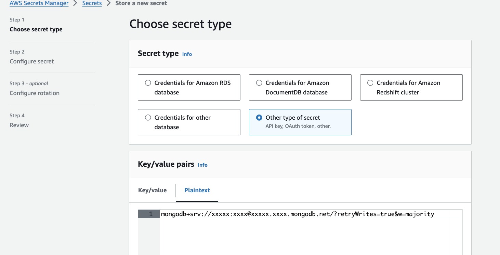
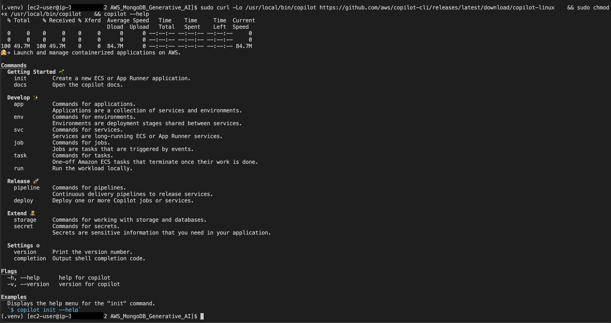
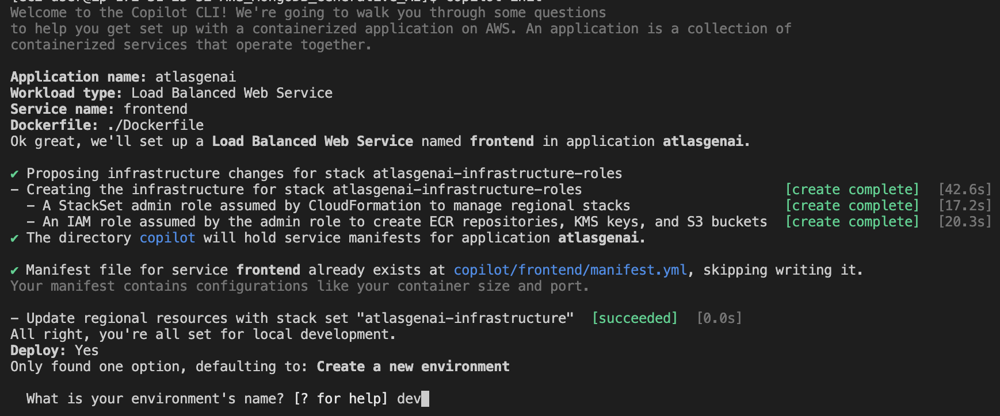
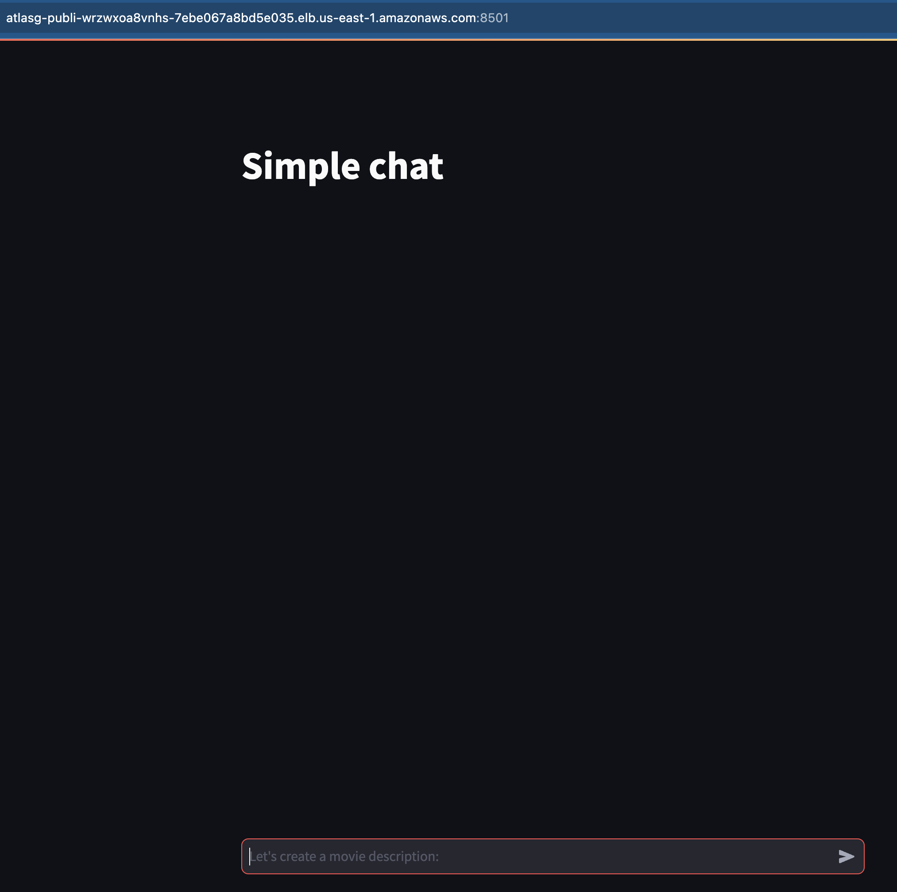
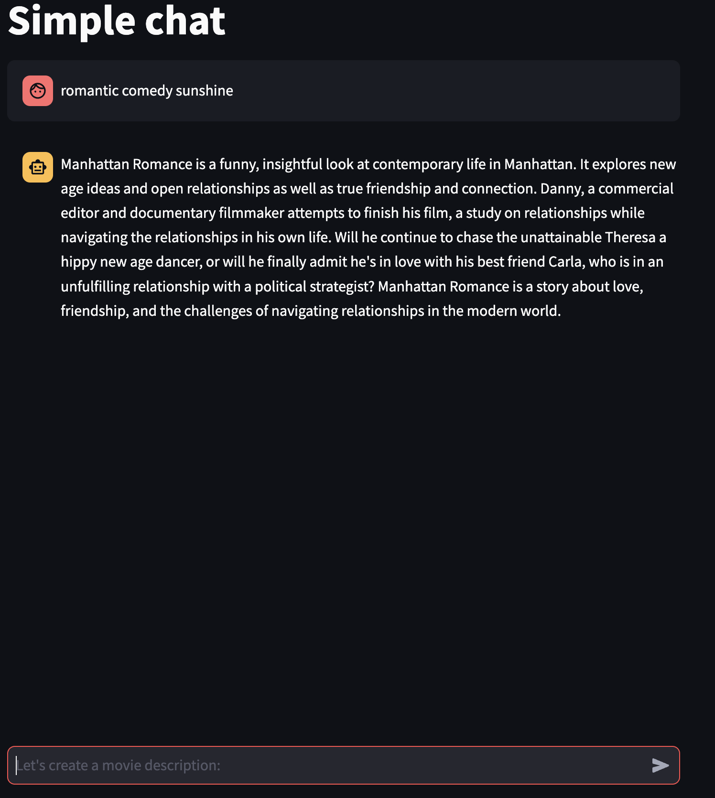

# Building Generative AI application MongoDB Atlas, Bedrock, Langchain, and Streamlit

## Reference Architecture


## Creating a Secret in Secrets Manager
* You can skip this section and create the secret via CLI in the next section
* In AWS Console navigate to Secret Manager and click on Store a New secret
> 

* Choose Other type of secret then Plaintext tab and provide the connection string of the MongoDB Atlas Cluster. We have created the connection string in the previous lab.
> 

* Proceed to the next page where you supply secret name as `workshop/atlas_secret`
>   

* Continue to other pages without any changes to store the secret
> 

* Confirm the secret is created by observing it listed on the page.  Note: you might need hit refresh button to reload the secrets.
> 


* Run the cloudshell


* If you skipped secret creation in the previous section, run the following command to create the secret.  Make sure to provide your own user ID/password/cluster.
```
aws secretsmanager create-secret --name workshop/atlas_secret  --secret-string 'mongodb+srv://<your_user>:<your_password>@<your_cluster_dns>/?retryWrites=true&w=majority'
```
* Clone the repo
```
git clone https://github.com/mongodb-partners/AWS_MongoDB_Generative_AI.git
cd AWS_MongoDB_Generative_AI/bedrock_atlas_vector_search_streamlit/
```

## Load MongoDB Atlas Sample Dataset
* In MongoDB Atlas Console, from your Cluster menu select Load Sample Dataset
>
## Vector Search Index Creation
> * Navigate Data Services|Your Cluster|Brows Collections|Atlas Search
> 


* Select `movies` collection from `sample_mflix` database and copy and paste the JSON snippet below.

```
  {
  "fields": [
    {
      "numDimensions": 1536,
      "path": "eg_vector",
      "similarity": "cosine",
      "type": "vector"
    }
  ]
}
```

* Select Next
> 

* Confirm Index Creation by clicking on Create Search Index
> 

* Observe index being created
> 

* Once the index is in status Active, it is ready for use.
> 


# Enable Model Access
* In this step we need to enable access to several models
* In AWS Console, navigate to Amazon Bedrock|Model Access. 
> 
* Click on Manage Model Access and select all models under Amazon. Click on Request model to proceed.
> 
* Observe Access status to be Access Granted
> 


## Create Embeddings


* Run the following code in terminal and wait for the program to finish:

```
python create_embeddings.py
```
> \

* Now observe the vector containing embeddings created in MongoDB Atlas.  Note: because we are not updating the full dataset you might need to filter the records by supplying this filter expression: `{"eg_vector":{"$exists": true}}`
> 

## Run Search to verify
* In terminal run the following command to perform vector search
```
 python query_atlas.py
```
* Verify that program returns search results:
> 


* Next, we run the program that adds a generative feature.  
```
 python llm_atlas.py
```
* Based on the retrieved description, we are now generating a description for a new movie. 
>


## Run Streamlit app
* Before we can run the streamlit app, we need install ECS Copilot CLI by running the following commands

```
 sudo curl -Lo /usr/local/bin/copilot https://github.com/aws/copilot-cli/releases/latest/download/copilot-linux    && sudo chmod +x /usr/local/bin/copilot    && copilot --help
```


* Install the Application and Environment using ECS copilot

```
copilot init
```

* Select the Load Balanced Web Services


* Name the service 


* Enter the custom path for Dockerfile 


* Give the path for the Dockerfile


* Give yes to "Would you like to deploy an environment?"


* Give a name to the environment



* Run Streamlit app to create chatbot using the command below
```
streamlit run app.py
```
> 

* Open the external URL in a separate browser tab. You should see the app loaded
> 
* Type several keywords to generate a new movie description. You can add or remove keywords to generate new descriptions.  
> 

# Summary
* Congratulations!  You have deployed an app that performs semantic search in MongoDB Atlas and mashes up several descriptions into one!